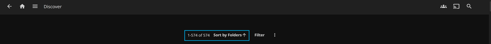
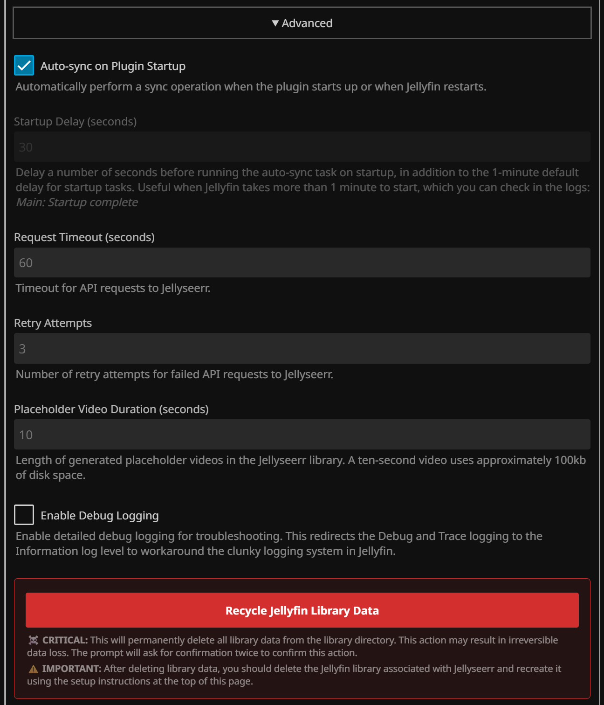

# JellyBridge Plugin

A Jellyfin plugin that bridges Jellyfin with Jellyseerr for seamless movie and series discovery and download requests.

## ❤️ Thank you for being a beta tester!

## 📣 Release Notes

### Version 2.0 🎉

**🆕 New in this release**
- Sort Discover Content: automated task with interval and algorithm selection (None, Random, Smart, Smartish), on-demand "Refresh Discover Library Sort Order", and optional "Mark Media Played".
- Manage Discover Library: "Use Network Folders" setup with "Generate Network Folders", optional "Duplicate Discover Content", and configurable "Library Prefix"; improved exclusions and favorites cleanup.
- Import Discover Content: two-pane region/network picker with search/refresh and an on-demand import button.
- Advanced & UX: startup run of enabled tasks with delay, task/request timeouts, new "Enable Trace Logging", and an Automated Sync Status bar (running/idle, progress, last/next run).

**⚠️ Compatibility Notes**
This version is tested with Jellyfin 10.10.7 and 10.11.2 for compatibility.
- To prevent errors after upgrading, the option `Advanced → Auto-sync on Plugin Startup` is disabled by default. Re-enable it if desired.
- If you use "Use Network Folders" (previously "Create separate libraries for streaming services"), review and re-enable the related options after upgrading.
- `Manage Discover Library → Favorite Cleanup` functionality changed to always ignore and unmark played for requested favorites. The option only affects whether the favorited items are unfavorited.

After installing the new version, you may need to update the plugin configuration page using these instructions:
`Jellyfin uses caching for the plugin configuration pages, so you may need to do a hard refresh of the page to see the latest changes. In Chrome, Open Developer Tools (F12) → Right-click Refresh button → "Empty Cache and Hard Reload".`

### Version 1.0

**🙏 A Note to Early Testers**: Thank you! I have fixed a lot of bugs on the backend with the v1.3.0.* release, and some new features! I hope the flurry of issues does not stop you from checking out the new release. I tested this release on both 10.10.7 and 10.11.1 releases. Please continue submitting issues with new feature ideas and reporting bugs.

## ✨ Features

- **Native Jellyfin Support**: Whether you use Android TV or Kodi to sync videos and favorites with Jellyfin, this plugin has you covered
- **New Discover Content**: Updates movies and series listings from selected networks (Netflix, Prime Video, etc.)
- **Make Jellyseerr Requests**: Enables requesting new movies and series directly from a Jellyfin library, making this accessible from mobile apps, Android TV, and even Kodi Sync Queue!
- **More Content**: Integrates with [Jellyseerr's existing services](https://docs.seerr.dev/using-jellyseerr/settings/services) when you mark movies or series as favorites in Jellyfin
- **Scheduled Tasks**: Automatically syncs movies and series on a configurable schedule and on Jellyfin startup
- **Smart Exclusion**: Uses native Jellyfin configuration files to exclude movies and series that already exist in your other Jellyfin libraries
- **Shuffle Content**: Native support on Android TV for random or smart-sort for browsing discover content, always fresh!

## 🧩 Jellyfin Integration

The plugin integrates seamlessly with Jellyfin, displaying shuffled discover content that users can browse and mark as favorites to request downloads.

Get Jellyfin here: [jellyfin.org](https://jellyfin.org/). For setup, see the official [installation guide](https://jellyfin.org/docs/general/installation/).

### Library View

The plugin manages libraries and folders in Jellyfin, creating structure for discovered content.

### Items View

Browse all discovered movies and series from Jellyseerr networks with thumbnails and metadata.

### Sorting

To see the intended order, set the JellyBridge library sort to **Play count** (Ascending). This works using the task to sort discover content, which updates play counts to create a dynamic browsing order.

### Placeholder Videos

The plugin generates placeholder videos for movies and series that aren't yet available in your Jellyfin libraries. These placeholder videos are created using FFmpeg with configurable duration settings.

### Jellyseerr Integration

The plugin seamlessly integrates with Jellyseerr to manage download requests and track availability of movies and series.

When users mark movies or series as favorites in Jellyfin, the plugin automatically sends download requests to Jellyseerr for processing. The user who requested the content is shown in Jellyseerr as the requestor, all you have to do is import the Jellyfin users. Any integrations with [Jellyseerr's existing services](https://docs.seerr.dev/using-jellyseerr/settings/services) can manage the content creation in Jellyfin. After content is requested, the movie or series is hidden from the JellyBridge library.

Get Jellyseerr here: [seerr.dev](https://seerr.dev). For setup, see the official [installation guide](https://docs.seerr.dev/getting-started).

After installing Jellyseerr, disable the JellyBridge library to prevent requests from being marked as Available.

### Kodi Sync Plugin for Jellyfin

Browse with Kodi and request content from Jellyfin via the Jellyfin add-on.

**Discover Content**: Open Add-ons → Video Add-ons → Jellyfin → JellyBridge Library (Movies or Shows) → Random Items / Recommended Items / any other view
**Jellyseer Requests**: Open any Library view → right-click a movie or show → Jellyfin options → Add to favorites

 
For native Jellyfin support, install [Kodi Sync Queue](https://github.com/jellyfin/jellyfin-plugin-kodisyncqueue). For plugin setup, see the official [Jellyfin Kodi client docs](https://jellyfin.org/docs/general/clients/kodi/).
- Note: Incompatible with JellyCon for Kodi.

## 📦 Installation

### Method 1: Automatic Installation (Recommended)

1. **Add Plugin Repository to Jellyfin:**
   - Go to Jellyfin Admin Dashboard → Plugins → Catalog
   - Click ⚙️ icon (Jellyfin 11: "Manage Repositories" button)
   - Click "Add Repository" button (Jellyfin 11: "New Repository" button)
   - Enter Repository Name: JellyBridge
   - Enter Repository URL: `https://raw.githubusercontent.com/kinggeorges12/JellyBridge/refs/heads/main/manifest.json`
   - Click "Add"

2. **Install Plugin:**
   - Go to Plugins → Catalog (Jellyfin 11: Plugins → Available)
   - Find "JellyBridge" under Metadata (Jellyfin 11: Other)
   - Click "Install"
   - Restart Jellyfin from the Dashboard

   Note on versions:
   - For Jellyfin 10.11.* users only, install the version ending in `.11` from the plugin page.
   - Versions ending in `.10` or `.0` are for Jellyfin 10.10.* only, although the wonky Jellyfin plugin versioning does not let me change the visibility.
   

3. **Configure the plugin** through the admin interface

### Method 2: Manual Installation

1. Download the plugin ZIP file from the [releases](../../releases)
2. Extract the contents to your Jellyfin plugins directory
3. Restart Jellyfin
4. Configure the plugin through the web interface

## 🛠️ Configuration

Access the plugin configuration from the host machine at: `http://localhost:8096/web/#/configurationpage?name=JellyBridge`

### Usage

The plugin includes a modern, responsive web interface for configuration. Follow these steps to get started:

1. **Configure the plugin** through the web interface with your Jellyseerr credentials and directory paths
2. **Create JellyBridge Library** in Jellyfin with the options suggested on the plugin configuration page
3. **Test the connection** to ensure Jellyseerr is accessible
4. **Import discover content** to browse movies and shows from Jellyseerr
5. **Mark movies or series as favorites** in Jellyfin to automatically request downloads
6. **Customize sorting** to show users a variety of discover content

The plugin provides a comprehensive web-based configuration interface with the following sections:

### 🌉 Main Configuration

- **Jellyseerr URL**: The web address where your Jellyseerr instance is accessible to Jellyfin.
- **API Key**: Authentication key that allows the plugin to communicate with Jellyseerr.
- **Library Directory**: Path where JellyBridge stores its files. Use a dedicated directory for this plugin.
- **Enable the Automated Task to Sync Jellyseerr and Jellyfin**: Turns on automatic syncing on a schedule.
- **Sync Interval (Hours)**: How often the plugin automatically syncs content (hours).
- **Test Connection with Jellyseerr**: Verifies that the plugin can successfully connect to your Jellyseerr instance
- **Automated Sync Status**: Displays the current sync status, current progress, last sync time, and next scheduled sync time.
- **Library Setup Instructions**: Click the "Setup" button (?) next to the automated task checkbox to view library setup instructions and troubleshooting.

### 🔍 Import Discover Content

- **Region**: Which geographic region to use for searching networks
- **Network Services**: Choose which networks to include using the two-pane picker
- **Discover Pages**: The number of pages to import per network
- **Content Retention Time (Days)**: How long to keep discover content before automatic cleanup
- **Import Discover Content from Jellyseerr into JellyBridge Library**: Manually trigger the task

### 📁 Manage Discover Library

- **Manage JellyBridge Library**: Automatically refreshes all Jellyfin libraries containing the JellyBridge library directory after each sync
- **Hide Discover Content Already in Jellyfin Libraries**: Excludes movies and shows from the JellyBridge library if they already exist in your other Jellyfin libraries
- **Favorite Cleanup**: Unfavorite items from the JellyBridge library after requesting them from Jellyseerr
- **Use Network Folders**: Creates separate folders for each selected network service so you can map each to its own Jellyfin library
- **Network Folder Setup**
  - **Setup Instructions**: Step-by-step guide for creating network folders and libraries
  - **Library Prefix**: Prefix applied to generated network library names
  - **Duplicate Discover Content for JellyBridge Libraries**: Allows the same title to exist in multiple JellyBridge libraries if each library's network selection is unique
  - **Generate Network Folders**: Button to create the folder structure for all selected networks
- **Request JellyBridge Library Favorites in Jellyseerr**: Manually trigger the task

### 🔀 Sort Discover Content

- **Enable the Automated Task to Sort Discover Content**: Periodically updates play counts to drive sort order for all users
- **Sort Task Interval (Hours)**: How often to run the sort task
- **Sort Order**: Choose algorithm
  - **None**: Sets all play counts to zero
  - **Random**: Randomizes play counts
  - **Smart**: Semi-intelligent ordering based on genres in each user's library
  - **Smartish**: Smart ordering with a little randomness
- **Mark Media Played**: Change 🔵 badge appearance in the JellyBridge library
- **Refresh Discover Library Sort Order**: Manually apply the selected algorithm immediately

**Instructions**: To see the sorted order, each user must open the JellyBridge library and change the default sort option *Sort by Folder* to *Sort by **Play count** (Sort order **Ascending**)*. For Android TV users, sort by ***Last Played***. Not recommended for Kodi, which already has a feature for random and recommended sorting.

### ⚙️ Advanced Settings

- **Run Automated Tasks on Plugin Startup**: Runs all enabled automated tasks when Jellyfin starts
- **Startup Delay (seconds)**: How many long to wait before running the startup tasks
- **Task Queue Timeout (minutes)**: How long to wait for queued JellyBridge tasks to start behind running tasks
- **Request Timeout (seconds)**: Jellyseerr API requests wait time
- **Retry Attempts**: Number of retry attempts for failed API requests to Jellyseerr
- **Placeholder Video Duration (seconds)**: A short video teaching users how to request the discover content
- **Enable Debug Logging**: Normal logging
- **Enable Trace Logging**: Huge logs
- **Cleanup Metadata**: Button to manually clean up metadata in the JellyBridge library
- **Recycle JellyBridge Library Data**: Permanently deletes all data from the JellyBridge library directory and requires confirmation twice

## 🧰 Logging & Troubleshooting

The plugin integrates with Jellyfin's logging system. Enable debug logging from the advanced options to record detailed logs. Check Jellyfin logs for debugging information:

- Plugin initialization and configuration
- API calls to Jellyseerr
- Series sync operations
- Library management
- Error messages and warnings

If you encounter any issues with the plugin, please leave a comment in the [GitHub Discussions](https://github.com/kinggeorges12/JellyBridge/discussions).

**⚠️ Compatibility Note**: This plugin has been *fully tested using Jellyfin 10.10.7 and 10.11.2* with Jellyseerr 2.7.3. Previous versions lacked compatibility with Jellyfin 10.11.\*, but that has been resolved as of the plugin version 1.3.0.\*! Unknown compatibility with Jellyfin versions before 10.10.0 or after 10.11.2, or Jellyseerr versions before 2.7.3.

Tips:
- If the config UI doesn’t reflect the latest changes after an update, force-refresh the page (see Release Notes for steps).
- If favorites cannot be requested from the Manage Library page, temporarily disable CSRF protection in Jellyseerr (Settings → Network → uncheck “Enable CSRF Protection”).

## 🧑‍💻 Development

For detailed development instructions, including building, testing, and contributing, see [Development.md](Development.md).

## 📄 License

This project is open source and available under the GNU General Public License v3.0.

## 📌 Acknowledgments

Thank you to the creator of the [Overseer-Jellyfin Bridge Script](https://github.com/geekfreak21/Overseer-and-Jellyfin-Bridged) for the inspiration. Special thanks to the developers of the [Intro Skipper](https://github.com/intro-skipper) and [Custom Tabs](https://github.com/IAmParadox27/jellyfin-plugin-custom-tabs) plugins for reusing their GPL-licensed code in the UI styling and configuration patterns.

And of course, thanks to the developers of [Jellyfin](https://jellyfin.org/) and [Jellyseerr](https://seerr.dev/) for making it all possible.