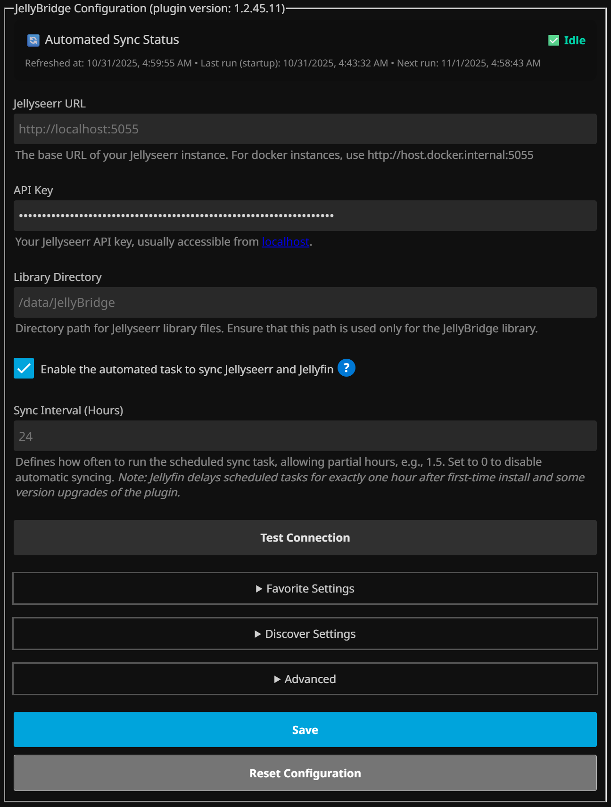
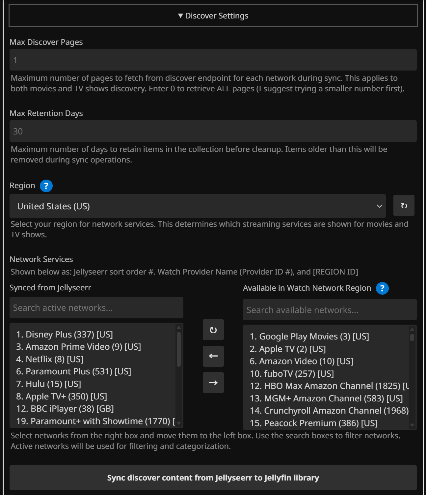

# JellyBridge Plugin

A Jellyfin plugin that bridges Jellyfin with Jellyseerr for seamless movie and series discovery and download requests.

**⚠️ Compatibility Note**: This plugin has been tested with Jellyfin 10.10.7 and Jellyseerr 2.7.3. It may not be compatible with Jellyfin 10.11.* or different Jellyseerr versions.

## Features

- **Make Jellyseerr Requests**: Enables requesting new movies and series directly from a Jellyfin library, making this accessible even from mobile apps!
- **Automated Content Listing**: Automatically lists movies and series from various networks (Netflix, Prime Video, etc.) within Jellyfin as placeholders
- **Easy Downloads**: Sends download requests to Jellyseerr when you mark movies or series as favorites in Jellyfin
- **Customizable**: Allows selection of networks to fetch and display in Jellyfin
- **Scheduled Sync**: Automatically syncs movies and series on a configurable schedule and on Jellyfin startup
- **Library Management**: Prevents placeholder movies and series from appearing in main libraries
- **Separate Libraries**: Option to create dedicated libraries for each network
- **Smart Exclusion**: Uses `.ignore` files to exclude movies and series that already exist in your main Jellyfin libraries

## Jellyfin Integration

The plugin integrates seamlessly with Jellyfin, displaying discovered content as placeholder videos that users can browse and mark as favorites to request downloads.

### Library View

The plugin manages libraries and folders in Jellyfin, creating structure for discovered content.

### Items View

Browse all discovered movies and series from Jellyseerr networks with thumbnails and metadata.

### Placeholder Videos

The plugin generates placeholder videos for movies and series that aren't yet available in your Jellyfin libraries. These placeholder videos are created using FFmpeg with configurable duration settings.

- **Smart Detection**: Jellyfin automatically identifies and displays placeholder videos
- **Automatic Generation**: Creates placeholder videos for movies and series not yet in your Jellyfin library
- **Configurable Duration**: Control the length of placeholder videos
- **Retry Logic**: Includes retry attempts to ensure FFmpeg availability before generating placeholders
- **Efficient Caching**: Cached placeholder videos are reused to minimize generation overhead

### Jellyseerr Integration

The plugin seamlessly integrates with Jellyseerr to manage download requests and track availability of movies and series.

When users mark movies or series as favorites in Jellyfin, the plugin automatically sends download requests to Jellyseerr for processing. The user who requested the content is shown in Jellyseerr as the requestor, all you have to do is import the Jellyfin users. Any integrations with Jellyseerr like Radarr and Sonarr will manage the content creation in Jellyfin. After content is found in other Jellyfin libraries, the movie or series is hidden from the JellyBridge library.

## Installation

### Method 1: Automatic Installation (Recommended)

1. **Add Plugin Repository to Jellyfin:**
   - Go to Jellyfin Admin Dashboard → Plugins → Catalog
   - Click "Settings" (gear icon)
   - Click "Add Repository"
   - Enter Repository URL: `https://raw.githubusercontent.com/kinggeorges12/JellyBridge/refs/heads/main/manifest.json`
   - Click "Add"

2. **Install Plugin:**
   - Go to Plugins → Catalog
   - Find "JellyBridge"
   - Click "Install"
   - Restart Jellyfin when prompted

3. **Configure the plugin** through the admin interface

### Method 2: Manual Installation

1. Download the plugin ZIP file from the [releases](../../releases)
2. Extract the contents to your Jellyfin plugins directory
3. Restart Jellyfin
4. Configure the plugin through the web interface

## Configuration

Access the plugin configuration at: `http://your-jellyfin-server/Plugins/JellyBridge/ConfigurationPage`

### Usage

The plugin includes a modern, responsive web interface for configuration. Follow these steps to get started:

1. **Configure the plugin** through the web interface with your Jellyseerr credentials and directory paths
2. **Create JellyBridge Library** in Jellyfin with the options suggested on the plugin configuration page
3. **Test the connection** to ensure Jellyseerr is accessible
4. **Enable the plugin** and trigger an initial sync
5. **Mark movies or series as favorites** in Jellyfin to automatically request downloads

The plugin provides a comprehensive web-based configuration interface with the following sections:

### Main Configuration

- **Enable Plugin**: Enable or disable the automated sync task
- **Sync Interval**: How often to sync in hours, allowing partial hours
- **Jellyseerr URL**: The base URL of your Jellyseerr instance
- **API Key**: Your Jellyseerr API key (found in Settings → General)
- **Test Connection**: Button to validate your Jellyseerr connection

### 📁 Favorite Settings

- **Library Directory**: Path to JellyBridge's library directory - *Note*: Due to frequent rewrites, consider using an SSD for the library location to minimize wear on HDDs
- **Manage JellyBridge Library**: After syncing, refreshes libraries containing the Library Directory path
- **Exclude from Main Libraries**: Excludes streaming movies/series that appear in Jellyfin libraries via .ignore files
- **Create Separate Libraries**: Creates dedicated libraries for each network
- **Library Prefix**: Prefix for network library names

### 🔍 Discover Settings

- **Max Discover Pages**: Maximum pages to fetch from discover endpoint per network
- **Max Retention Days**: Days to retain items before cleanup
- **Region**: Watch network region for determining available networks
- **Network Services**: Multi-select interface to choose which networks to sync

### ⚙️ Advanced Settings

- **Auto Sync on Startup**: Automatically perform sync when plugin starts
- **Startup Delay**: Seconds to wait before auto-sync on startup
- **Request Timeout**: Timeout for API requests in seconds
- **Retry Attempts**: Number of retry attempts for failed requests
- **Enable Debug Logging**: Enable detailed debug logging
- **Placeholder Duration**: Duration of placeholder videos in seconds

## Logging & Troubleshooting

The plugin integrates with Jellyfin's logging system. Enable debug logging from the advanced options to record detailed logs. Check Jellyfin logs for debugging information:

- Plugin initialization and configuration
- API calls to Jellyseerr
- Series sync operations
- Library management
- Error messages and warnings

If you encounter any issues with the plugin, please leave a comment in the [GitHub Discussions](https://github.com/kinggeorges12/JellyBridge/discussions).

## Development

For detailed development instructions, including building, testing, and contributing, see [Development.md](Development.md).

## License

This project is open source and available under the GNU General Public License v3.0.

## Acknowledgments

Thank you to the creator of the [Overseer-Jellyfin Bridge Script](https://github.com/geekfreak21/Overseer-and-Jellyfin-Bridged) for the inspiration. Special thanks to the developers of the [**Intro Skipper**](https://github.com/intro-skipper) and [**Custom Tabs**](https://github.com/IAmParadox27/jellyfin-plugin-custom-tabs) plugins for reusing their GPL-licensed code in the UI styling and configuration patterns.

And of course, thanks to the developers of [**Jellyfin**](https://jellyfin.org/) and [**Jellyseerr**](https://seerr.dev/) for making it all possible.